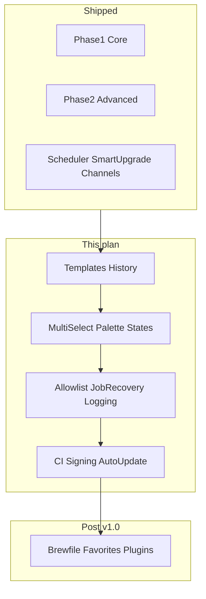
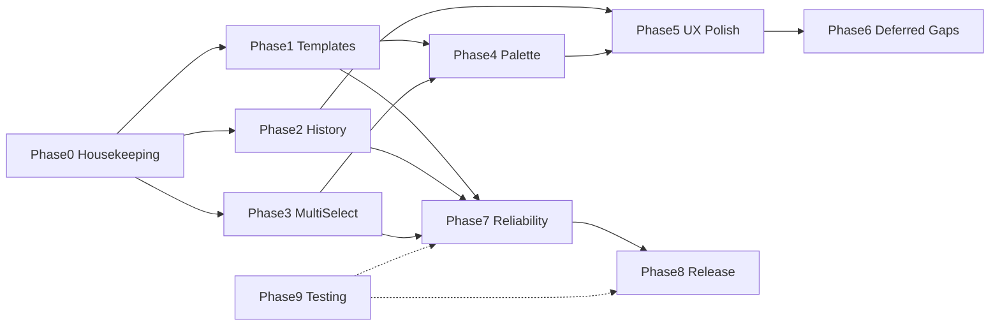

# Brewdeck — Comprehensive Implementation Plan

## Current baseline

| Area | State |
|------|--------|
| Feature scope | Phases 1–2 done; Phase 3 ~90% (scheduler, smart upgrade, update channels shipped) |
| Version | [`package.json`](package.json) still `0.1.0` despite v0.4-level features |
| Job tracking | Session-only in [`jobs.store.ts`](src/app/core/stores/jobs.store.ts); main emits via [`JobEventSink`](electron/services/homebrew-service.ts) |
| Settings | [`settings-store.ts`](electron/services/settings-store.ts) + [`appSettingsSchema`](src/shared/contracts.ts) |
| Security | Double Zod parse (preload + IPC); argv builders in [`homebrew-service.ts`](electron/services/homebrew-service.ts); **no runner allowlist** |
| Release | [`auto-update.ts`](electron/services/auto-update.ts) stub (logs only); placeholder publish URL; **no CI** |
| Tests | `npm run test:all` green; strong unit coverage on parsers/planners, weak IPC→UI integration/E2E |



---

## Cross-cutting conventions (apply to every phase)

1. **Contracts first** — extend [`src/shared/contracts.ts`](src/shared/contracts.ts) with Zod schemas; mirror in [`electron/preload.ts`](electron/preload.ts) and [`electron/ipc.ts`](electron/ipc.ts); add channel names to [`electron/ipc-channels.ts`](electron/ipc-channels.ts).
2. **Command path** — all mutations flow: IPC → `build*Command()` → `runQueuedTrackedJob()` → `BrewRunner.spawn()`; never add raw user argv.
3. **Job attribution** — extend `BrewJobProgressEvent` / complete/failed events with optional `source: 'manual' | 'scheduler' | 'template' | 'batch'` and `correlationId` for logging.
4. **Tests** — each IPC addition gets vitest in `electron/ipc.test.ts` + service tests; renderer gets component/store specs matching existing patterns in `updates-view.component.spec.ts`.

---

## Phase 0 — Housekeeping (0.5–1 day)

**Goal:** Align docs, version, and roadmap with reality before new features.

| Task | Files |
|------|-------|
| Commit roadmap checkboxes (smart upgrade + update channels) | [`roadmap.md`](roadmap.md) |
| Bump version to `0.4.0` (feature-complete Phase 3 automation) | [`package.json`](package.json) |
| Sync README IPC list with [`ipc-channels.ts`](electron/ipc-channels.ts) | [`README.md`](README.md) |
| Add `CHANGELOG.md` with v0.2–v0.4 feature summary | new file |

---

## Phase 1 — Complete Phase 3: Action templates (3–5 days)

**Goal:** Reusable, named command presets (e.g. “install + pin”) executed as a sequenced job chain with one confirmation.

### Data model

Add to [`src/shared/contracts.ts`](src/shared/contracts.ts):

```ts
// actionTemplateSchema
{
  id: string;           // uuid
  name: string;         // user label
  steps: Array<{
    action: BrewJobAction;  // subset: install | pin | unpin | upgradeOne
    // step-specific params resolved at run time from context
  }>;
  createdAt: string;
  updatedAt: string;
}
```

Persist in [`settings-store.ts`](electron/services/settings-store.ts) as `actionTemplates: ActionTemplate[]` (cap e.g. 20 templates), merged like other settings keys.

### Execution (main)

- New IPC: `templates:list`, `templates:save`, `templates:delete`, `templates:run`.
- New service: `electron/services/action-template-runner.ts`:
  - Validates template steps against an **allowlisted step matrix** (install → pin allowed; uninstall → pin blocked).
  - Runs steps sequentially via existing `HomebrewService` methods on `mutationQueue` (reuse queue, do not parallelize brew).
  - Emits a synthetic parent `jobId` + child step progress in job events (`stepIndex`, `stepTotal` optional fields on progress events).

### UI (renderer)

- **Settings section** in [`settings-view.component.ts`](src/app/features/settings/settings-view/settings-view.component.ts): CRUD list, step builder (add/remove/reorder steps).
- **Invoke points:**
  - Overflow menu on Installed/Browse/Updates: “Run template…”
  - Command palette: “Run template…” → pick template → pick package (Phase 2 palette work shares picker).
- **Confirmation:** extend existing confirm-dialog pattern with multi-command preview (list each `brew …` line).

### Tests

- `action-template-runner.test.ts`: allowed/blocked step sequences, failure mid-chain stops queue.
- Settings round-trip + max template count.

---

## Phase 2 — Local history and analytics (4–6 days)

**Goal:** Durable timeline of brew operations with lightweight insights; separate from session activity drawer.

### Persistence (main)

New `electron/services/job-history-store.ts` using `electron-store` file `brew-gui-job-history`:

```ts
interface JobHistoryRecord {
  jobId: string;
  action: BrewJobAction;
  packageName: string | null;
  kind: BrewJobKind | null;
  status: 'succeeded' | 'failed';
  command: string;
  exitCode: number | null;
  durationMs: number;
  error: string | null;
  source: JobSource;
  startedAt: string;
  completedAt: string;
  // output: optional truncated tail (e.g. last 2KB) for diagnostics
}
```

**Write hook:** extend global `jobEventSink` in [`electron/main.ts`](electron/main.ts) — on `onComplete` / `onFailed`, append record (retention: last 500 jobs or 90 days, configurable later).

**Read IPC:** `history:list` (paginated, filters by action/status/date), `history:stats` (aggregates: failure rate by action, avg duration, last-7-day counts).

### UI (renderer)

- New route `/history` + nav item in app shell sidebar.
- **History view:** table grouped by day; filters (action, status); click row opens read-only output panel (reuse drawer output rendering).
- **Analytics strip:** cards for success rate, median duration, top failing actions (computed from `history:stats`).

### Session drawer behavior

- [`jobs.store.ts`](src/app/core/stores/jobs.store.ts): `clearHistory()` clears UI only; add tooltip “Session log — full history in History view”.
- Optional: “View in History” link on completed jobs.

### Tests

- History store retention + pagination.
- Sink writes on scheduler jobs (`source: 'scheduler'`).

---

## Phase 3 — UX: Multi-select and batch actions (5–7 days)

**Goal:** User-selected subsets for upgrade/uninstall/pin with one queued job sequence.

### Shared selection layer

New `src/app/core/stores/package-selection.store.ts` (or per-view signals with shared helper):

- `selectedIds: Set<string>`
- `toggle(id)`, `selectAll(ids)`, `clear()`, `count`
- Injected into Installed + Updates views only (Browse install is single-target).

### Row UI

Extend [`package-row.component.ts`](src/app/components/shared/package-row/package-row.component.ts):

- Optional leading checkbox (`selectable`, `selected`, `selectionChange`).
- Toolbar above list when `count > 0`: “Upgrade N”, “Uninstall N”, “Pin N” (context-dependent).

### Batch execution (main)

- New IPC: `brew:upgradeMany`, `brew:uninstallMany`, `brew:pinMany` with Zod arrays (max 50 items).
- Implementation: loop `runQueuedTrackedJob` on `mutationQueue` (same serial semantics as today); return `BatchJobResult` with per-item outcomes.
- **Guards:** skip pinned on upgrade; block cask pin; respect smart-upgrade blocked list for batch upgrade option.

### Refactor (renderer)

Extract shared action helpers from:

- [`installed-packages-view.component.ts`](src/app/features/installed/installed-packages-view/installed-packages-view.component.ts)
- [`updates-view.component.ts`](src/app/features/updates/updates-view/updates-view.component.ts)

Into `src/app/core/services/package-actions.service.ts` to avoid triplicating overflow + batch logic.

### Confirm dialogs

- Plural titles, scrollable package list, aggregated command preview.

### Tests

- Batch IPC validation (empty array, over limit, mixed kinds).
- View specs: select-all respects channel filter on Updates.

---

## Phase 4 — UX: Command palette package actions (3–4 days)

**Goal:** Keyboard-first install/uninstall/pin/details without hunting rows.

### Palette architecture

Refactor [`app-shell.component.ts`](src/app/layout/app-shell/app-shell.component.ts):

- Static nav actions remain.
- Add **dynamic groups** via `computed()`:
  - `packageSearchGroup` — fuzzy match against active route store (Installed / Updates / Browse catalog).
  - `selectionGroup` — when `PackageSelectionStore.count > 0`, show bulk actions.
  - `templateGroup` — when templates exist (Phase 1).

### New palette flows

| Action | Behavior |
|--------|----------|
| Install package… | Opens palette sub-search on catalog; on select → install confirm |
| Uninstall package… | Sub-search on Installed; confirm |
| Pin package… | Installed formulae only |
| View package details… | Opens details drawer |
| Run template… | Template picker → package picker → confirm |

Use existing [`command-palette.component.ts`](src/app/components/ux/command-palette/command-palette.component.ts) + `ZardCommand`; may need nested palette state (`mode: 'root' | 'pickPackage'`).

### Bridge pattern

`PackageCommandService` coordinates facade + stores + dialogs; shell delegates palette `runPaletteAction` to it for package-scoped ids.

### Tests

- Extend [`app-shell.component.spec.ts`](src/app/layout/app-shell/app-shell.component.spec.ts) for new action ids and package search.

---

## Phase 5 — UX polish: Empty/error states, diff preview, undo (4–5 days)

### Better empty/error states

- Shared component: `src/app/components/ux/diagnostic-panel/`
  - Props: title, message, `copyText` (full stderr/IPC error), suggested actions (links to Doctor, Settings, retry).
- Wire into: [`brew-missing-view`](src/app/features/missing-brew/brew-missing-view/brew-missing-view.component.ts), store error signals in Installed/Updates/Browse, job failed rows in drawer.

### Diff preview (upgrades)

- Before upgrade confirm: show `installedVersion → currentVersion` (already in outdated data); optional `brew info` changelog snippet if available from [`getPackageDetails`](electron/ipc.ts) (best-effort, non-blocking).
- Updates confirm dialog + smart-upgrade dialog.

### Undo-safe patterns (limited scope)

Only where Homebrew supports reversal without data loss:

- **Pin** → offer “Unpin” toast action.
- **Exclude from smart upgrade** → “Allow again” toast.
- Do **not** promise undo for uninstall (destructive).

---

## Phase 6 — Deferred core gaps (3–4 days)

| Item | Approach |
|------|----------|
| **Dependency-impact warning** (uninstall) | IPC `brew:getUninstallImpact` running `brew uses --installed <name>` (formula) or document cask limitations; show in [`uninstall-confirm-dialog`](src/app/components/ux/) |
| **Advanced install flags** | Extend `installOneRequestSchema` with optional `force: boolean`; map to `--force` in `buildInstallCommand`; settings toggle “Show advanced install options” |

---

## Phase 7 — Reliability and security (5–7 days)

**Critical for beta/public release.**

### 7a. Command allowlist

New `electron/services/brew-command-registry.ts`:

- Registry of allowed subcommands + param shapes.
- `BrewRunner.runAllowed(commandKey, params)` — only entry point for spawn.
- Refactor [`homebrew-service.ts`](electron/services/homebrew-service.ts) builders to register keys; audit inline argv (`upgradeAll`, `doctor`, git spawn).

Add shared `brewTokenSchema` in contracts:

```ts
const brewTokenSchema = z.string().regex(/^[A-Za-z0-9+@._/-]+$/, 'invalid package name');
```

Apply to package/service names (taps already strict).

### 7b. Crash resilience

- Persist in-flight jobs to `electron-store` `brew-gui-active-jobs` on `queued`/`running`; clear on complete/fail.
- On app start in [`main.ts`](electron/main.ts): IPC `jobs:recover` returns unfinished jobs; renderer shows banner in activity drawer with “Dismiss” / “View output”.

### 7c. Structured logging

- Extend [`electron/utils/logger.ts`](electron/utils/logger.ts): JSON lines to `app.getPath('logs')/brew-gui/main.log`.
- Include `correlationId` (= `jobId`) on all job log lines.
- Optional renderer log bridge (`app:log` IPC) for debug builds only.

### 7d. Telemetry (opt-in, local-first default)

- Settings: `telemetryEnabled: false` default.
- If enabled: aggregate only (action counts, durations)—no package names; store locally or flush to configurable endpoint later.

---

## Phase 8 — Platform and distribution (5–8 days)

**Target: v0.5 private beta, then v1.0 public.**

### 8a. CI

Add [`.github/workflows/ci.yml`](.github/workflows/ci.yml):

```yaml
# macos-latest: npm ci, npm run test:all, npm run build
# optional: npm run package:dir on tag
```

### 8b. Signing and notarization

- Document env vars: `CSC_LINK`, `CSC_KEY_PASSWORD`, `APPLE_ID`, `APPLE_APP_SPECIFIC_PASSWORD`, `APPLE_TEAM_ID`.
- electron-builder `mac.identity` + `notarize` in [`package.json`](package.json) `build.mac`.
- CI secrets on release tags only.

### 8c. Auto-update (complete stub)

[`auto-update.ts`](electron/services/auto-update.ts) today only logs. Finish:

- Replace publish URL in `package.json`.
- Download + notify renderer (`app:updateAvailable` event).
- Settings or tray UI: “Restart to update”.
- Keep `ENABLE_AUTO_UPDATES=1` gate for staged rollout.

### 8d. Branding

- Full icon set in `public/icons/`; tray state variants (updates available, error, idle).
- Validate arm64 + x64 matrix in CI or release checklist.

### Version milestones

| Release | Includes |
|---------|----------|
| **v0.5** | Phases 0–3 + 7a–7b + 8a–8b (beta to trusted users) |
| **v1.0** | Phases 4–7 complete + 8c–8d + E2E matrix |

Bump to `0.5.0` at beta tag; `1.0.0` at public.

---

## Phase 9 — Testing roadmap (parallel, 6–10 days cumulative)

| Track | Scope |
|-------|-------|
| **Integration** | IPC round-trips for install/uninstall/pin with mocked `BrewRunner` |
| **E2E** | Playwright or Spectron successor: tray popover, scheduler quiet hours, palette |
| **Failure modes** | Missing brew, timeout, malformed `brew list` JSON |
| **Visual** | Optional Playwright screenshots for Updates/Installed/History |

Prioritize integration tests before E2E (higher ROI given Electron cost).

---

## Phase 10 — Nice-to-have (post v1.0)

Defer until after public release unless explicitly prioritized:

- Brewfile import/export
- Favorites/watchlist
- Security advisory overlay
- Team mode / plugin system

---

## Dependency graph (implementation order)



**Recommended sprint order:** P0 → P2 → P1 → P3 → P7a → P8a → P4 → P5 → P6 → P7b–d → P8b–d → P9.

---

## Risk register

| Risk | Mitigation |
|------|------------|
| Batch jobs feel slow (serial queue) | Show per-item progress in drawer; consider progress bar with `stepIndex` |
| History store grows large | Retention policy + no full stdout by default |
| Template runner security | Step allowlist matrix; no free-form argv in templates |
| Auto-update breaks signed builds | Test on tagged CI artifacts only |
| Palette complexity | Nested modes in one component; avoid duplicate search UIs |

---

## Success criteria

- Phase 3 roadmap items checked off (templates + history).
- `npm run test:all` + CI green on macOS.
- v0.5: signed DMG, job history survives restart, batch upgrade of 10+ packages works.
- v1.0: auto-update, allowlist enforced, E2E covers tray + scheduler, README/CHANGELOG accurate.